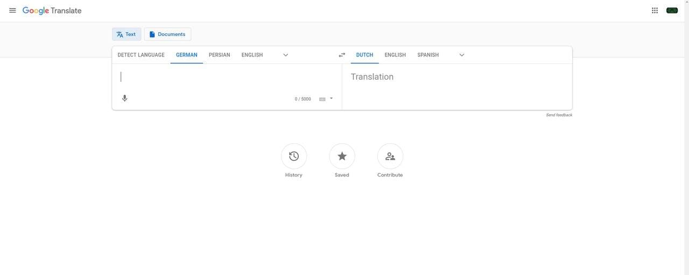

Planet Earth Countries App using React⚛️, GraphQL🛠️, Material-UI🖌️

Github Pages url==>  https://ciamac-da.github.io/planet-earth-react-graphql/
# About the APP📎 ==> It contains the list of countries that I recieve from GraphQL server & a search🔭 filter Input(you can search through countries base on a language name that you search for in input) & Google Translate functionality(you can klick on 2 languagues and then press Translate, and it will redirected to Google Translate URL und shows us 2 selected Languages on Google Translate)

# Let's ROCK 🤘 and take a look at some features 🚀  

# Main Page!

# Searching for a Language!

# Selecting the first language to translate!

# Selecting the second language to translate!

# Klicking on Translate button and redirecting to the Google Translate url!

# Google Translate opens up!

# How does it looks like on Mobile(in this case iPhone-X)

# How does it looks like on Tablets(in this case iPad-Pro)

# Implementing 404 page! 🛑

